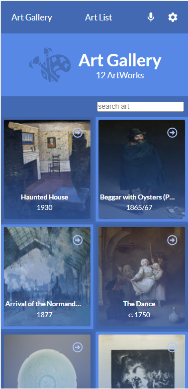
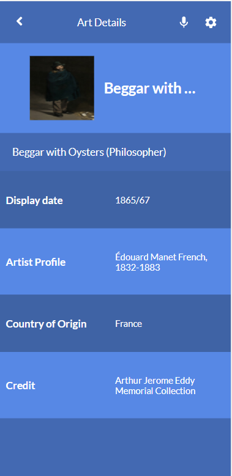

# Art Gallery
- In this Project, I created  a react web app that displays the list of art works gotten from art institute of chicago API

## Project Preview

Home page                                |  details page
:---------------------------------------:|:---------------------------------------:
                   |   


## Live Demo
> Click [here](https://art-gallery-project.netlify.app) to see the live preview of the project.

> [link to video](https://drive.google.com/file/d/15FqQc1mx5iqg_-NDpUidSZZQtd4hld-m/view?usp=sharing)

### Built With

- [React](https://es.reactjs.org/)
- [HTML](https://www.w3schools.com/html/)
- [CSS](https://www.w3schools.com/css/)
- [JS](https://www.javascript.com/)

# Getting Started with Create React App

This project was bootstrapped with [Create React App](https://github.com/facebook/create-react-app).

### Installation

1. Clone the repository
   ```sh
   git clone https://github.com/xtrahuman/art-gallery.git
   ```
2. Install NPM packages
   ```sh
   npm install
   ```
3. Run server
   ```sh
   npm start
   ```
## Authors

👤 **Okpara Tochukwu**

- GitHub: [@xtrahuman](https://github.com/xtrahuman)
- LinkedIn: [LinkedIn](https://linkedin.com/in/tochukwuokpara)

## 🤝 Contributing

Contributions, issues, and feature requests are welcome!

Feel free to check the [issues page](../../issues/).

## Acknowledgments

Original design idea by Nelson Sakwa on Behance.

## Show your support

Give a ⭐️ if you like this project!